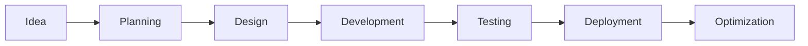

<!-- ======================================================================= -->
<!--                         ULTRA PREMIUM GITHUB README                      -->
<!-- ======================================================================= -->

<div align="center">


<br/>


<br/><br/>


</div>

---

# <div align="center">⚡ CONNECT WITH ME</div>

<div align="center">

<a href="https://nithish-portfolio-sigma.vercel.app/">

</a>

<a href="https://linkedin.com/in/nithishwaran-a-05655725b">

</a>

<a href="mailto:nithishwaran2005333@gmail.com">

</a>

<a href="https://instagram.com/itzz_nithish_">

</a>

<a href="https://github.com/nithishwaran">

</a>

</div>

---

# <div align="center">👨‍💻 ABOUT ME</div>

<div align="center">

<table>
<tr>
<td width="55%" valign="top">

```typescript
class Developer {

  name = "Nithishwaran"

  title = "Full Stack Developer"

  specialization = [
    "Frontend Engineering",
    "Backend Development",
    "Responsive UI Design",
    "System Architecture",
    "Performance Optimization",
    "API Development"
  ]

  frontend = [
    "React",
    "Next.js",
    "TypeScript",
    "Tailwind CSS",
    "Bootstrap",
    "Redux"
  ]

  backend = [
    "Node.js",
    "Express.js",
    "REST APIs",
    "Authentication",
    "Socket.io"
  ]

  database = [
    "MongoDB",
    "MySQL",
    "Firebase"
  ]

  tools = [
    "Git",
    "GitHub",
    "Figma",
    "VS Code",
    "Postman",
    "Vercel"
  ]

  currentFocus = [
    "Scalable Applications",
    "Premium UI Systems",
    "Modern Backend Patterns",
    "Cloud Architecture"
  ]

  currentlyBuilding = "PlacementApp"

  openToCollaborate = true

}
````

</td>

<td width="45%" align="center">


</td>
</tr>
</table>

</div>

---

# <div align="center">🚀 TECH STACK</div>

<div align="center">

## FRONTEND


<br/><br/>

## BACKEND


<br/><br/>

## TOOLS


</div>

---

# <div align="center">🔥 FEATURED PROJECTS</div>

<div align="center">

<table>
<tr>
<td width="50%">

## 🎓 PlacementApp

A modern campus recruitment platform connecting:

* Students
* Recruiters
* Placement Officers
* Admin Teams

### Features

* Authentication System
* Role Based Access
* Company Management
* Eligibility Tracking
* Mock Tests
* Resume Upload
* Analytics Dashboard
* Admin Verification
* Student Profiles
* Notifications

### Tech Stack

```yaml
Frontend:
  - React
  - Tailwind CSS
  - Redux

Backend:
  - Node.js
  - Express.js

Database:
  - MongoDB

Deployment:
  - Render
  - Vercel
```

<a href="https://placementapp-0htf.onrender.com/">

</a>

</td>

<td width="50%">

## 🌐 Developer Portfolio

Modern animated portfolio website featuring:

* Smooth Animations
* Responsive Layouts
* Dark UI
* Project Showcase
* Skills Section
* Contact Form
* Dynamic Hero Section
* SEO Optimization
* Performance Optimized

### Tech Stack

```yaml
Frontend:
  - Next.js
  - TypeScript
  - Tailwind CSS

Deployment:
  - Vercel
```

<a href="https://nithish-portfolio-sigma.vercel.app/">

</a>

</td>
</tr>
</table>

</div>

---

# <div align="center">📊 GITHUB ANALYTICS</div>

<div align="center">


<br/><br/>


</div>

---

# <div align="center">🏆 ACHIEVEMENTS</div>

<div align="center">


</div>

---

# <div align="center">🐍 CONTRIBUTION SNAKE</div>

<div align="center">


</div>

---

# <div align="center">💡 DEVELOPMENT PHILOSOPHY</div>

<div align="center">

<table>
<tr>
<td align="center" width="33%">

## ⚡ Performance

I focus on creating optimized applications with:

* Fast loading times
* Lazy loading
* Code splitting
* Efficient rendering
* Optimized API calls

</td>

<td align="center" width="33%">

## 🎨 UI/UX

Design principles:

* Clean interfaces
* Modern layouts
* Glassmorphism
* Smooth animations
* Responsive design

</td>

<td align="center" width="33%">

## 🔒 Scalability

Architecture goals:

* Clean code
* Reusable components
* Maintainable structure
* Modular systems
* Scalable backend

</td>
</tr>
</table>

</div>

---

# <div align="center">🛠 CURRENT LEARNING</div>

<div align="center">

| Technology       | Progress         |
| ---------------- | ---------------- |
| System Design    | ████████████░░░░ |
| Cloud Computing  | ██████████░░░░░░ |
| DevOps           | ████████░░░░░░░░ |
| Advanced Backend | █████████████░░░ |
| UI Animation     | ███████████████░ |

</div>

---

# <div align="center">📈 DEVELOPMENT JOURNEY</div>

```text
2021  → Started Web Development
2022  → Learned MERN Stack
2023  → Built Full Stack Projects
2024  → Focused on UI/UX Design
2025  → Advanced Backend Systems
2026  → Scalable Architecture & Products
```

---

# <div align="center">💻 CODING ACTIVITY</div>

<div align="center">


</div>

---

# <div align="center">🎯 GOALS</div>

* Build scalable SaaS products
* Create premium UI systems
* Contribute to open source
* Learn cloud architecture
* Master system design
* Build impactful developer tools
* Create modern digital experiences
* Collaborate on innovative products

---

# <div align="center">🧠 RANDOM DEV QUOTE</div>

<div align="center">


</div>

---

# <div align="center">🎵 SPOTIFY NOW PLAYING</div>

<div align="center">


</div>

---

# <div align="center">☕ SUPPORT</div>

<div align="center">

If you like my work and projects:

⭐ Star my repositories

🤝 Connect with me

🚀 Collaborate on projects

💡 Share ideas and innovations

</div>

---

# <div align="center">📬 CONTACT</div>

<div align="center">

<a href="mailto:nithishwaran2005333@gmail.com">

</a>

<a href="https://linkedin.com/in/nithishwaran-a-05655725b">

</a>

<a href="https://github.com/nithishwaran">

</a>

</div>

---

<div align="center">


</div>

<!-- ======================================================================= -->

<!--                           EXTRA PREMIUM SECTIONS                         -->

<!-- ======================================================================= -->

# <div align="center">⚙️ WORKFLOW</div>



---

# <div align="center">📚 KNOWLEDGE BASE</div>

## Frontend Concepts

* Virtual DOM
* Hydration
* CSR
* SSR
* Responsive Design
* State Management
* Hooks
* Context API
* Performance Optimization
* Accessibility

## Backend Concepts

* REST APIs
* Authentication
* Authorization
* MVC Architecture
* Middleware
* Rate Limiting
* Validation
* Security
* Caching
* WebSockets

## Database Concepts

* Relationships
* Aggregation
* Indexing
* Optimization
* Data Modeling
* Transactions

---

# <div align="center">🎨 DESIGN STYLE</div>

| Style             | Usage             |
| ----------------- | ----------------- |
| Glassmorphism     | Premium UI        |
| Dark Mode         | Better Aesthetics |
| Gradients         | Visual Depth      |
| Neon Glow         | Modern Feel       |
| Blur Effects      | Clean Design      |
| Smooth Animations | Better Experience |

---

# <div align="center">🚀 FUTURE PLANS</div>

```yaml
2026 Goals:
  - Build SaaS Products
  - Learn Kubernetes
  - Master Cloud Deployment
  - Create Design Systems
  - Improve DSA Skills
  - Build AI Integrated Apps
  - Learn Microservices
```

---

# <div align="center">📦 FAVORITE TOOLS</div>

| Tool          | Purpose          |
| ------------- | ---------------- |
| VS Code       | Development      |
| Figma         | UI Design        |
| Postman       | API Testing      |
| GitHub        | Version Control  |
| Vercel        | Deployment       |
| MongoDB Atlas | Database Hosting |

---

# <div align="center">⚡ FUN FACTS</div>

* I love creating premium UI designs
* I enjoy solving frontend challenges
* I focus on scalable architecture
* I constantly learn new technologies
* I enjoy building real-world products

---

# <div align="center">🌟 FINAL MESSAGE</div>

<div align="center">

"Great products are built with clean code, modern design, and innovative thinking."

</div>

---

<div align="center">


</div>

---

<div align="center">

## THANK YOU ❤️

</div>

---

# <div align="center">🧩 ADVANCED SKILLS MATRIX</div>

<div align="center">

| Category | Technologies                         |
| -------- | ------------------------------------ |
| Frontend | React, Next.js, TypeScript, Tailwind |
| Backend  | Node.js, Express.js, REST APIs       |
| Database | MongoDB, MySQL, Firebase             |
| DevOps   | Vercel, Render, GitHub Actions       |
| Design   | Figma, UI/UX, Prototyping            |
| Tools    | VS Code, Postman, Git                |

</div>

---

# <div align="center">🌌 PROFILE SHOWCASE</div>

<div align="center">


<br/><br/>


</div>

---

# <div align="center">📌 FEATURE HIGHLIGHTS</div>

## Modern UI Principles

* Responsive Design
* Dark Theme Optimization
* Premium Gradients
* Glassmorphism Layouts
* Animation Driven UX
* Interactive Components
* Pixel Perfect Alignment

## Backend Architecture

* Modular Structure
* RESTful APIs
* JWT Authentication
* Role Based Access
* Scalable Database Design
* Secure Middleware
* Error Handling

## Performance Optimization

* Lazy Loading
* Image Optimization
* API Caching
* Code Splitting
* Bundle Optimization
* Server Side Rendering

---

# <div align="center">📂 PROJECT STRUCTURE</div>

```bash
src/
 ┣ components/
 ┣ pages/
 ┣ layouts/
 ┣ hooks/
 ┣ redux/
 ┣ services/
 ┣ utils/
 ┣ assets/
 ┣ styles/
 ┗ constants/
```

---

# <div align="center">⚡ TERMINAL STYLE CARD</div>

```bash
> initializing developer profile...
> loading premium ui components...
> connecting github analytics...
> deploying scalable architecture...
> portfolio loaded successfully ✔
```

---

# <div align="center">🎨 UI COMPONENTS I LOVE</div>

| Component         | Purpose            |
| ----------------- | ------------------ |
| Hero Sections     | First Impression   |
| Bento Grids       | Modern Layouts     |
| Glass Cards       | Premium Feel       |
| Animated Buttons  | Better UX          |
| Dashboard Panels  | Data Visualization |
| Mobile Navigation | Responsive Access  |

---

# <div align="center">🧠 DEVELOPMENT MINDSET</div>

```text
Think → Design → Build → Optimize → Scale
```

---

# <div align="center">📊 WEEKLY DEVELOPMENT BREAKDOWN</div>

```text
Frontend Development    ███████████████░░░░  70%
Backend Development     ██████████░░░░░░░░  50%
UI/UX Design            █████████████░░░░░  65%
Learning New Skills     ███████████░░░░░░░  55%
Open Source             ██████░░░░░░░░░░░░  30%
```

---

# <div align="center">🌐 SOCIAL LINKS</div>

<div align="center">

<a href="https://github.com/nithishwaran">

</a>

<a href="https://linkedin.com/in/nithishwaran-a-05655725b">

</a>

<a href="https://instagram.com/itzz_nithish_">

</a>

<a href="mailto:nithishwaran2005333@gmail.com">

</a>

</div>

---

# <div align="center">🚀 OPEN SOURCE GOALS</div>

* Build impactful projects
* Share reusable components
* Improve UI accessibility
* Create scalable templates
* Contribute to developer community
* Learn from collaboration

---

# <div align="center">✨ FINAL FOOTER</div>

<div align="center">


</div>

```


```
